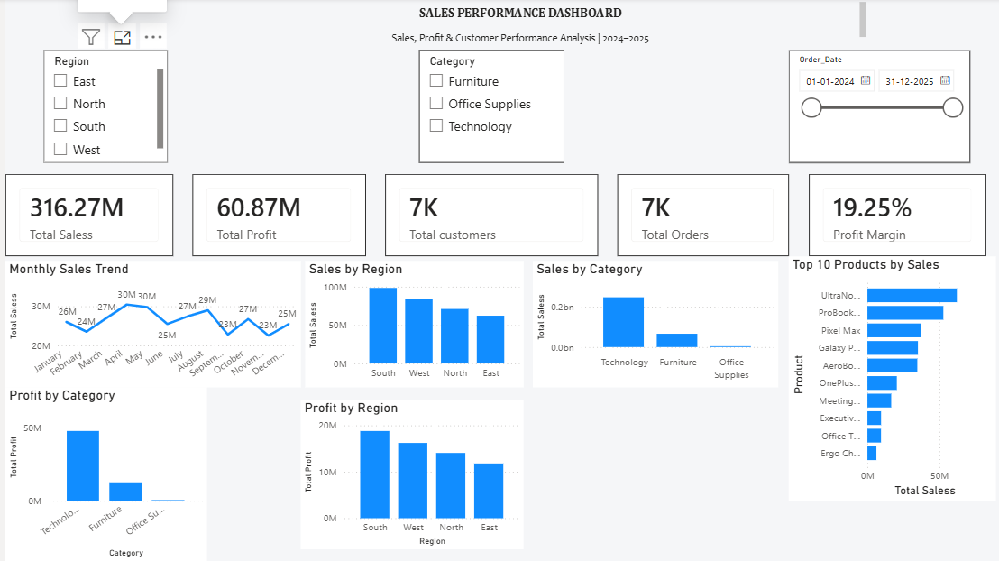

# Sales Performance Dashboard

An interactive **Sales Performance Dashboard** built in **Microsoft Power BI** using a cleaned sales dataset from Excel.

## Dashboard Preview



## Project Objective

The goal of this project is to analyze sales and profitability data and present the results through an interactive Power BI dashboard.

The dashboard helps users explore:

- Overall sales performance
- Profitability
- Orders and customers
- Monthly sales trends
- Regional performance
- Category performance
- Top-selling products
- Profit by category and region

## Dataset

**Source file:** `Sales_Performance_Dashboard_Raw_Data.xlsx`

**Main sheet:** `Raw_Sales_Data`

**Records:** 7,000

**Fields:**
- `Order_ID`
- `Order_Date`
- `Customer_ID`
- `Customer_Name`
- `Region`
- `State`
- `Category`
- `Sub_Category`
- `Product`
- `Quantity`
- `Unit_Price`
- `Discount`
- `Sales`
- `Cost`
- `Profit`
- `Total Sales`
- `Clean_Region`

## Tools Used

- **Microsoft Power BI**
- **Microsoft Excel**
- **DAX**
- **Git / GitHub**

## Dashboard Features

### KPI Cards

- Total Sales
- Total Profit
- Total Orders
- Total Customers
- Profit Margin

### Visualizations

- Monthly Sales Trend
- Sales by Region
- Sales by Category
- Top 10 Products by Sales
- Profit by Category
- Profit by Region

### Interactive Slicers

- Region
- Category
- Order Date

Selecting a region or category dynamically updates the dashboard metrics and visualizations.

## DAX Measures

### Total Sales

```DAX
Total Sales Measure = SUM(Raw_Sales_Data[Sales])
```

### Total Profit

```DAX
Total Profit Measure = SUM(Raw_Sales_Data[Profit])
```

### Total Orders

```DAX
Total Order Measure = DISTINCTCOUNT(Raw_Sales_Data[Order_ID])
```

### Total Customers

```DAX
Total customer Measure = DISTINCTCOUNT(Raw_Sales_Data[Customer_ID])
```

### Profit Margin

```DAX
Profit Margin =
DIVIDE([Total Profit Measure], [Total Sales Measure], 0)
```

## Key Business Insights

- Technology generated the highest sales and profit among the categories shown in the dashboard.
- South recorded the highest sales and profit among the regions shown in the dashboard.
- The dashboard shows an overall profit margin of **19.25%** for the displayed period.

## Project Structure

```text
Sales-Performance-Dashboard/
│
├── data/
│   └── Sales_Performance_Dashboard_Raw_Data.xlsx
│
├── screenshots/
│   └── sales-performance-dashboard.png
│
├── docs/
│   └── DAX-Measures.md
│
└── README.md
```

## How to Run

1. Clone or download this repository.
2. Open the Power BI `.pbix` file used for the dashboard.
3. If Power BI asks for the Excel source, select the file inside the `data` folder.
4. Refresh the data.
5. Use the slicers to explore the dashboard.


## Author

**Yerrabolu Venkata Krishna**

B.Tech — Computer Science & Engineering (AI & ML)
